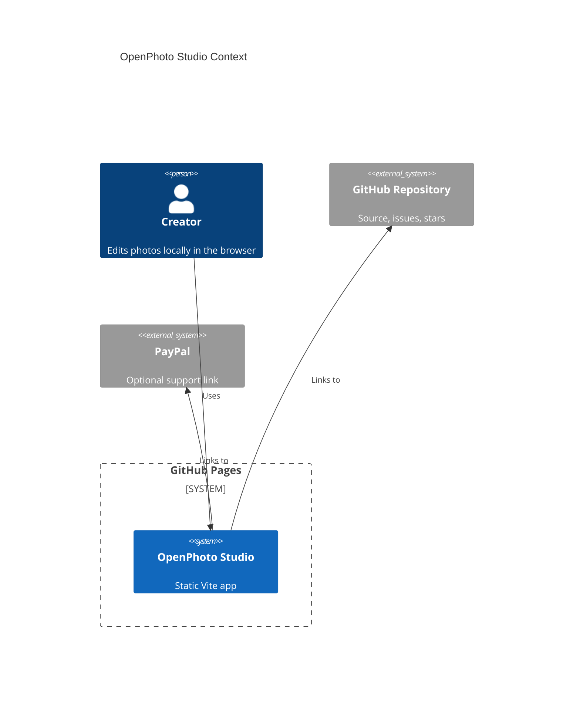

# OpenPhoto Studio

[Live site](https://baditaflorin.github.io/openphoto-studio/) · [GitHub repo](https://github.com/baditaflorin/openphoto-studio) · [Support via PayPal](https://www.paypal.com/paypalme/florinbadita)

Browser-based photo editor with WASM-ready imaging tools and local WebGPU AI features.

OpenPhoto Studio is a static GitHub Pages app for quick, private photo edits in the browser. It focuses on the 80% workflow most creators reach for first: import, adjust, mask, upscale, retouch, compare, and export without an account or subscription.

## Quickstart

```bash
npm install
make install-hooks
make dev
```

## Build

```bash
make lint
make test
make build
make smoke
```

## Architecture



See `docs/architecture.md` and `docs/adr/` for implementation decisions.

## Deployment

GitHub Pages serves the `gh-pages` branch. `make publish-pages` builds `dist/` and publishes it.

Complete deploy notes: `docs/deploy.md`
