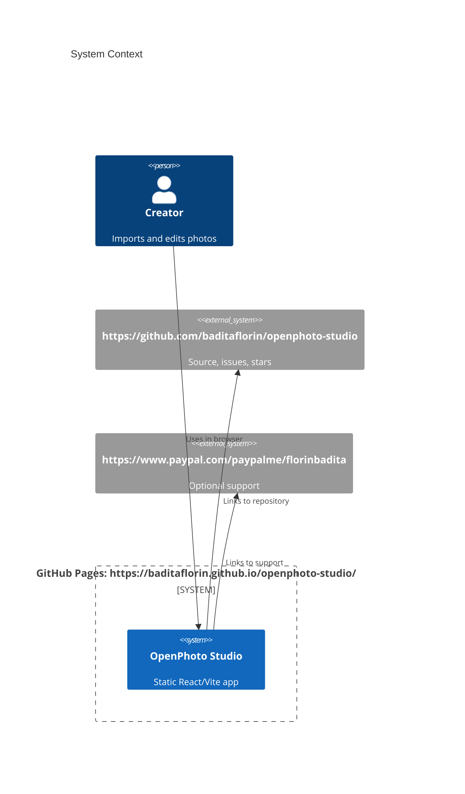
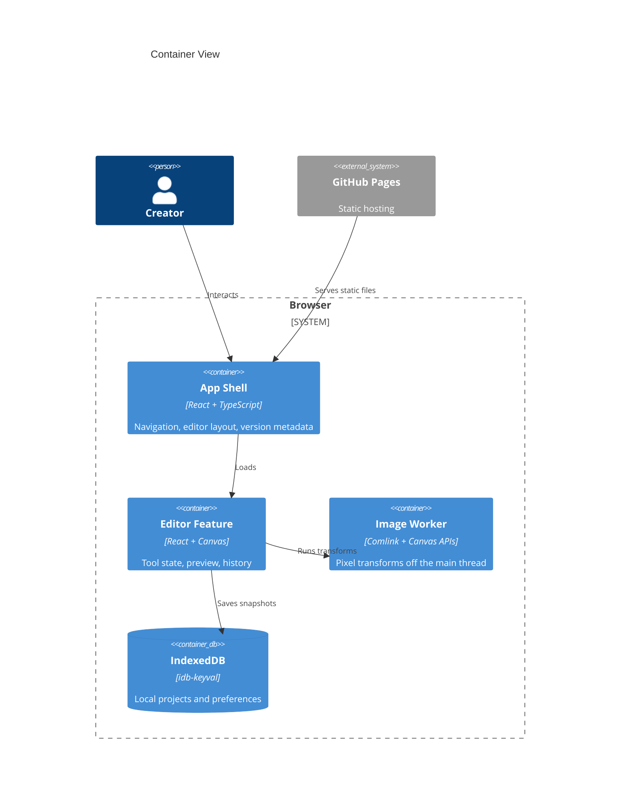

# Architecture

OpenPhoto Studio is a static browser application served by GitHub Pages. All image work happens on the user's device.

The GitHub Pages boundary is intentionally static. There is no runtime API, server database, or secret-bearing service in v1.
